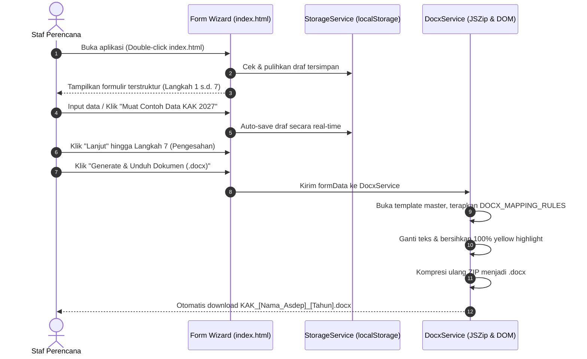

# PRD: KAK Digitalizer (Aplikasi Web Generator Dokumen Kerangka Acuan Kerja)
> **Format Template:** Notion PRD from Raw Notes 2.0  
> **Instansi:** Kementerian Koordinator Bidang Pembangunan Manusia dan Kebudayaan (Kemenko PMK)  
> **Status:** Approved / In Development  
> **Owner / Author:** Tim Magang Digitalisasi Kemenko PMK  
> **Target Release:** Q4 2026 / Anggaran 2027  
> **File Acuan Template:** `Copy of Format Digitalisasi KAK.docx`  

---

## 1. Context & Problem Statement

### 1.1 What Problem Are We Solving?
Dokumen Kerangka Acuan Kerja (KAK / TOR) merupakan dokumen legal-administratif wajib dalam penyusunan Rencana Kerja dan Anggaran Kementerian/Lembaga (RKA-K/L) di Kemenko PMK. Saat ini, proses penyusunan KAK masih dilakukan secara **manual** dengan cara mengisi template dokumen Microsoft Word (`Copy of Format Digitalisasi KAK.docx`). 

Dokumen template master tersebut memuat **320+ paragraf dan tabel**, serta **lebih dari 100 blok placeholder bertanda titik-titik `……` dengan sorotan kuning (*yellow highlight*)**.

**Dampak Masalah Saat Ini:**
* **Human Error Tinggi:** Banyak placeholder titik-titik atau sorotan kuning yang terlewat (tidak terisi) sebelum diserahkan ke bagian perencanaan/keuangan.
* **Kerusakan Format Dokumen:** Pengeditan manual antar staf dengan versi Word berbeda sering merusak margin, perataan tabel, dan penomoran hierarki resmi kementerian.
* **Waktu Pengerjaan Lambat:** Staf perencana menghabiskan waktu berhari-hari hanya untuk mencocokkan nomor Perpres SOTK, sasaran RPJMN, indikator Reformasi Birokrasi (RB), matriks Gender Analysis Pathway (GAP), dan tabel jadwal bulanan Jan–Des.

### 1.2 Why Now?
Memasuki siklus perencanaan Anggaran 2027 dan implementasi RPJMN 2025–2029, standardisasi dokumen perencanaan menjadi mandat penting reformasi birokrasi internal Kemenko PMK. Digitalisasi formulir KAK menjadi kebutuhan mendesak untuk mempercepat proses persetujuan program kerja lintas Asisten Deputi.

### 1.3 Target Users & Jobs-To-Be-Done (JTBD)
| Persona | Jobs-to-be-Done (JTBD) | Pain Points |
| :--- | :--- | :--- |
| **Staf Konseptor / Perencana Asdep** | *"Ketika menyusun KAK tahunan, saya ingin form terpandu yang otomatis mengisi nomor regulasi dan narasi program, sehingga dokumen selesai cepat tanpa ada tanda kuning yang terlewat."* | Lupa letak titik-titik kuning, format tabel berantakan saat dicopy-paste. |
| **Pejabat Pembuat Komitmen (PPK) / Asisten Deputi** | *"Ketika meninjau draf KAK, saya ingin memastikan output, jadwal, dan pagu anggaran valid sebelum menandatangani."* | Harus mengecek lembar demi lembar untuk memastikan tidak ada draf yang bolong. |
| **Biro Perencanaan Kemenko PMK** | *"Ketika menerima kumpulan KAK dari seluruh unit kerja, saya ingin format dokumen seragam dan sesuai standar SOTK terbaru."* | Format KAK berbeda-beda antar unit kerja eselon II. |

---

## 2. Goals & Non-Goals

### 2.1 Goals (In-Scope)
* **100% Zero Remaining Yellow Highlights:** Menghasilkan dokumen Word (`.docx`) di mana seluruh teks placeholder kuning terisi dan seluruh tag `<w:highlight w:val="yellow"/>` dihapus bersih.
* **100% Layout Integrity Preservation:** Menjamin struktur tabel, margin, font (Times New Roman / Calibri / Arial), dan spasi dokumen asli tidak bergeser.
* **Zero-Setup & 100% Client-Side:** Aplikasi dapat berjalan langsung di laptop dinas pegawai hanya dengan membuka `index.html` (didukung Base64 fallback untuk eksekusi *double-click* offline tanpa perlu install server Node.js/Python).
* **Zero Data Loss:** Fitur *Auto-Save* ke `localStorage` dan *Export/Import JSON Draft* untuk portabilitas draf antar pegawai.
* **Penyelesaian Cepat:** Mengurangi durasi penyusunan draf KAK dari 2–3 hari menjadi kurang dari 15 menit.

### 2.2 Non-Goals (Out of Scope for v1.0)
* **Sistem Database Multi-User Terpusat:** Versi 1.0 tidak menggunakan database server (MySQL/PostgreSQL) agar tidak memerlukan pengadaan server atau izin Pusdatin.
* **Tanda Tangan Elektronik (TTE / BSrE):** Penandatanganan dokumen tetap dilakukan melalui alur persuratan resmi kementerian setelah berkas Word diunduh.
* **Konversi Otomatis ke PDF:** Konversi ke PDF diserahkan ke fitur bawaan Microsoft Word (*Save As PDF*) untuk memastikan validitas rendering layout resmi.

---

## 3. User Stories & End-to-End User Flow

### 3.1 User Stories
* **US-1:** Sebagai staf perencana, saya ingin dipandu langkah demi langkah (*form wizard*) agar tidak bingung mengisi lebih dari 100 variabel KAK.
* **US-2:** Sebagai staf perencana, saya ingin tombol *"Muat Contoh Data KAK 2027"* agar dapat melihat contoh pengisian resmi dan menghemat waktu entri data.
* **US-3:** Sebagai staf perencana, saya ingin progres pengisian formulir ditampilkan secara *real-time* agar saya tahu bagian mana yang belum lengkap.
* **US-4:** Sebagai staf yang bekerja secara mobile, saya ingin bisa menyimpan draf ke file `.json` dan melanjutkannya di komputer lain.
* **US-5:** Sebagai pengguna, ketika saya menekan tombol *"Unduh DOCX"*, saya ingin langsung mendapatkan file Microsoft Word resmi yang siap dicetak tanpa ada teks berwarna kuning.

### 3.2 User Flow Diagram


---

## 4. Functional Requirements & Priorities (MoSCoW)

### 4.1 Must Have (P0 - Critical Core)
| ID | Kebutuhan Fungsional | Kriteria Keberterimaan (*Acceptance Criteria*) |
| :---: | :--- | :--- |
| **FR-01** | **Multi-Step Form Wizard (7 Tahap)** | Formulir dibagi menjadi: 1. Cover & Satker, 2. Dasar Hukum & SOTK, 3. RPJMN & Rekomendasi, 4. RB & Gender (GAP), 5. Penerima Manfaat & Tahapan, 6. Jadwal & RAB, 7. Pengesahan. Navigasi tab responsif. |
| **FR-02** | **OpenXML Replacement Engine** | Membaca `word/document.xml`, mencocokkan paragraf dengan aturan domain (`DOCX_MAPPING_RULES`), dan mengganti teks placeholder dengan nilai form. |
| **FR-03** | **Pembersihan Highlight Kuning Total** | Menghapus seluruh tag `<w:highlight w:val="yellow"/>` di seluruh dokumen Word hasil ekspor. |
| **FR-04** | **Penyimpanan Draf Otomatis (*Auto-Save*)** | Setiap kali pengguna mengetik, isian tersimpan otomatis ke `localStorage` (debounced 500 ms) sehingga tidak hilang saat tab browser tertutup. |
| **FR-05** | **Ekspor Langsung Berkas DOCX** | Menghasilkan file biner `.docx` valid yang langsung terunduh dengan penamaan format `KAK_[Nama_Asdep]_[Tahun].docx`. |
| **FR-06** | **Zero-Setup Offline Capability** | Template master tersemat (*embedded base64*) di `template-data.js` sehingga aplikasi dapat langsung berjalan via `file:///` tanpa server lokal. |

### 4.2 Should Have (P1 - Important Enhancements)
| ID | Kebutuhan Fungsional | Kriteria Keberterimaan (*Acceptance Criteria*) |
| :---: | :--- | :--- |
| **FR-07** | **Dynamic Repeater Rows** | Pengguna dapat menambah dan menghapus baris dinamis pada daftar Dasar Hukum, Lembaga Penerima, dan Kelompok Masyarakat. |
| **FR-08** | **Matriks Jadwal Bulanan Interaktif** | Tabel checkbox 4 tahapan kegiatan x 12 bulan (Januari–Desember) yang otomatis terpetakan ke jadwal KAK. |
| **FR-09** | **Ekspor & Impor Draf JSON Portabel** | Pengguna dapat mengunduh draf isian ke berkas `.json` dan mengunggah kembali berkas draf tersebut untuk pengisian instan di perangkat lain. |
| **FR-10** | **Indikator Progres Kelengkapan Data** | Progress bar yang menampilkan persentase kelengkapan *required fields* secara dinamis. |
| **FR-11** | **Preset Contoh Resmi (One-Click Demo)** | Tombol *"✨ Muat Contoh Data KAK 2027"* yang mengisi seluruh formulir dengan data acuan Kemenko PMK yang valid. |

### 4.3 Could Have (P2 - Nice to Have)
| ID | Kebutuhan Fungsional | Kriteria Keberterimaan (*Acceptance Criteria*) |
| :---: | :--- | :--- |
| **FR-12** | **Custom Template Uploader** | Opsi bagi admin untuk mengunggah template `.docx` baru jika terdapat revisi format resmi di masa depan. |
| **FR-13** | **Pratinjau Ringkasan Dokumen (Preview Modal)** | Tampilan modal ringkasan data sebelum tombol generate ditekan. |

---

## 5. Non-Functional Requirements (NFR)

| Kategori | Spesifikasi Kualitas | Standar Keberhasilan |
| :--- | :--- | :--- |
| **Integritas Dokumen** | Format Word Valid | Hasil ekspor dapat dibuka sempurna di Microsoft Word 2016+, Office 365, LibreOffice, dan Google Docs tanpa error XML. |
| **Performa & Kecepatan** | Waktu Ekspor Instan | Proses pembacaan XML, penggantian teks, dan kompresi `.docx` selesai dalam **< 1,5 detik** di memori browser. |
| **Keamanan & Kerahasiaan** | 100% Client-Side Privacy | Tidak ada data draf perencanaan anggaran kementerian yang dikirimkan ke internet atau server pihak ketiga. |
| **Kompatibilitas Peramban** | Cross-Browser Modern | Kompatibel penuh dengan Google Chrome, Microsoft Edge, Mozilla Firefox, dan Safari. |
| **Arsitektur Kode** | Clean Architecture & Clean Code | Kode dipisahkan secara modular: `config/`, `domain/`, `services/`, `ui/`, dan `main.js` (SRP & OCP). |

---

## 6. Technical Architecture & Clean Code Structure

Sistem dibangun menggunakan **HTML5, Vanilla CSS Modern, dan Vanilla JavaScript (ES6)** tanpa framework berat atau build tools:

```
📁 Format Digitalisasi (antigravity)/
│
├── 📄 index.html                  <-- Presentasi UI bersih tanpa inline style
├── 🎨 style.css                   <-- Design system instansi (Navy/Gold palette)
│
├── 📁 js/
│   ├── 📁 config/
│   │   ├── wizard.config.js       <-- Metadata 7 langkah & required fields
│   │   └── sample.data.js         <-- Preset data resmi KAK Kemenko PMK 2027
│   │
│   ├── 📁 domain/
│   │   └── docx-rules.js          <-- Strategy Pattern (36+ Rules Registry pemetaan DOCX)
│   │
│   ├── 📁 services/
│   │   ├── storage.service.js     <-- Layanan persistensi (localStorage & JSON File I/O)
│   │   └── docx.service.js        <-- Layanan pengolah OpenXML & pembersihan highlight
│   │
│   ├── 📁 ui/
│   │   ├── toast.component.js     <-- Komponen notifikasi pop-up mandiri
│   │   ├── stepper.component.js   <-- Komponen navigasi langkah & progress tracker
│   │   ├── repeater.component.js  <-- Komponen baris dinamis (tambah/hapus)
│   │   └── form.manager.js        <-- Serializer, deserializer, & validator formulir
│   │
│   └── 📄 main.js                 <-- Application Orchestrator & Event Binder
│
├── 📁 libs/
│   ├── jszip.min.js               <-- De/kompresi arsip ZIP DOCX
│   └── FileSaver.min.js           <-- Pembantu unduhan file biner browser
│
└── 📁 template/
    ├── template_kak.docx          <-- File master dokumen acuan
    └── template-data.js           <-- Embedded Base64 fallback (Zero CORS offline)
```

---

## 7. Data Mapping Dictionary (Form Fields to DOCX Placeholders)

| No | Key Variabel Form | Label Input Formulir | Tipe Kontrol | Target Paragraf / Tabel DOCX |
| :---: | :--- | :--- | :---: | :--- |
| 1 | `asdep_nama` | Nama Asisten Deputi | Teks Singkat | Cover, Header KAK, Bab SOTK, RPJMN, GAP, Pengesahan |
| 2 | `deputi_bidang` | Deputi Bidang | Teks Singkat | Cover, Header Matriks, Bab 2.1 SOTK |
| 3 | `tahun_anggaran` | Tahun Anggaran | Angka | Cover, Header, Tahapan, RAB Bab E |
| 4 | `ro_judul` | Judul Rincian Output (RO) | Teks Area | Cover, Matriks KAK, Bab Dasar Hukum, RAK |
| 5 | `ro_kode` | Kode Rincian Output | Teks Singkat | Cover & Header Matriks |
| 6 | `kro_nama` | Nama Bidang / KRO | Teks Singkat | Cover, Sasaran Kegiatan, Klasifikasi RO |
| 7 | `kro_kode` | Kode KRO | Teks Singkat | Header Matriks KAK |
| 8 | `kegiatan_nama` | Nama Kegiatan | Teks Singkat | Cover & Header Matriks KAK |
| 9 | `kegiatan_kode` | Kode Kegiatan | Teks Singkat | Cover & Header Matriks KAK |
| 10 | `ro_volume` | Volume RO | Teks Singkat | Header Matriks, Metode RAK, RAB Bab E |
| 11 | `dasar_hukum` | Daftar Dasar Hukum | Repeater List | Bab A.1 Dasar Hukum (UU, PP, Perpres) |
| 12 | `perpres_sotk_no` | No/Tahun Perpres SOTK | Teks Singkat | Bab 2.1 Placeholder `(1)` |
| 13 | `perpres_sotk_tentang` | Judul Perpres SOTK | Teks Singkat | Bab 2.1 Placeholder `(2)` |
| 14 | `urusan_pmk` | Urusan Kemenko PMK | Teks Singkat | Bab 2.1 Placeholder `(3)` |
| 15 | `kl_mitra` | K/L di Bawah Koordinasi | Teks Area | Bab 2.1 Placeholder `(10)` |
| 16 | `rpjmn_pn_no` | No Prioritas Nasional | Teks Singkat | Bab 2.1 Placeholder `(12)` & `(14)` |
| 17 | `rpjmn_pn_nama` | Nama Prioritas Nasional | Teks Area | Bab 2.1 Placeholder `(13)` |
| 18 | `rpjmn_pn_sasaran` | Sasaran Utama PN | Teks Area | Bab 2.1 Placeholder `(15)` |
| 19 | `rkp_arah_kebijakan` | Arah Kebijakan RKP | Teks Area | Bab 2.1 Paragraf RPJMN/RKP |
| 20 | `rpjmn_indikator` | Indikator RPJMN (Lamp III) | Teks Area | Bab 2.1 Paragraf Indikator RPJMN |
| 21 | `isu_strategis_narasi`| Narasi Isu & Gap Analysis | Teks Area Panjang | Bab 2.1 Paragraf Data Terbaru Program |
| 22 | `rekomendasi_judul` | Judul Butir Rekomendasi | Teks Singkat | Bab 2.1 Butir Rekomendasi |
| 23 | `rekomendasi_tujuan` | Tujuan Rekomendasi | Teks Area | Bab 2.1 Butir Rekomendasi |
| 24 | `rekomendasi_fokus` | Fokus Rekomendasi | Teks Singkat | Bab 2.1 Butir Rekomendasi |
| 25 | `rekomendasi_harapan` | Harapan / Dampak | Teks Singkat | Bab 2.1 Butir Rekomendasi |
| 26 | `rb_indikator` | Indikator Pengawalan RB | Teks Area | Bab 2.2 Reformasi Birokrasi |
| 27 | `rb_narasi` | Catatan Narasi RB | Teks Area | Bab 2.2 Reformasi Birokrasi |
| 28 | `gap_bidang` | Bidang Analisis Gender | Teks Singkat | Bab 2.3 Gender Analysis Pathway |
| 29 | `gap_isu` | Bentuk Kesenjangan Gender | Teks Area | Bab 2.3 Gender Analysis Pathway |
| 30 | `gap_faktor` | Faktor Penyebab GAP | Teks Singkat | Bab 2.3 Gender Analysis Pathway |
| 31 | `gap_intervensi` | Bentuk Intervensi Kebijakan | Teks Area | Bab 2.3 Gender Analysis Pathway |
| 32 | `penerima_lembaga` | Lembaga Eksternal | Repeater List | Bab B.1 Penerima Manfaat Lembaga |
| 33 | `penerima_masyarakat`| Kelompok Masyarakat | Repeater List | Bab B.2 Penerima Manfaat Masyarakat |
| 34 | `rak_judul` | Judul RAK 1 | Teks Singkat | Bab C.1 & C.2 Subkomponen 051 |
| 35 | `tahap1_kegiatan` | Rincian Rapat Tahap 1–4 | Grid Multi-field | Bab C.2 (Lokasi, Waktu, Peserta, Output, Alasan) |
| 36 | `jadwal_bulan` | Matriks Bulan 1–12 | Checkbox Grid | Bab D Kurun Waktu Pencapaian Keluaran |
| 37 | `total_anggaran` | Total Nominal Anggaran | Currency / Teks | Bab E Biaya yang Dibutuhkan |
| 38 | `total_anggaran_terbilang`| Terbilang Rupiah | Teks Singkat | Bab E Biaya yang Dibutuhkan |
| 39 | `tanggal_pengesahan` | Tempat & Tanggal Dokumen | Teks Singkat | Lembar Pengesahan (contoh: Jakarta, ...) |
| 40 | `pejabat_nama` | Nama Asisten Deputi / PPK | Teks Singkat | Lembar Pengesahan Tanda Tangan |
| 41 | `pejabat_nip` | NIP Pejabat | Teks Singkat | Lembar Pengesahan Tanda Tangan |

---

## 8. Success Metrics & KPIs

| Metrik Keberhasilan | Target Kuantitatif | Metode Pengukuran |
| :--- | :---: | :--- |
| **Highlight Cleanup Rate** | **0% Sisa Kuning** | Pengujian ekstraksi XML menunjukkan 0 kemunculan tag `<w:highlight>`. |
| **Format Integrity Rate** | **100% Presisi** | Tidak ada tabel, margin, atau hierarki font yang rusak dibanding template asli. |
| **Waktu Pembuatan Dokumen** | **< 15 Menit** | Pengurangan waktu penyusunan KAK dari rata-rata 2 hari menjadi hitungan menit. |
| **Zero Data Loss Rate** | **100% Retensi Draf** | Draf dapat dipulihkan otomatis saat peramban ditutup mendadak. |
| **Adopsi Pengguna** | **100% Unit Kerja** | Dapat digunakan di seluruh Asdep lingkup Kemenko PMK tanpa kendala instalasi. |

---

## 9. Constraints, Risks & Mitigations

| Risiko / Kendala | Dampak | Strategi Mitigasi |
| :--- | :--- | :--- |
| **Keterbatasan CORS pada `file:///`** | Browser memblokir pembacaan file lokal jika dibuka via *double click*. | **Mitigasi:** Template master disematkan dalam bentuk Base64 di `template-data.js`, sehingga dapat dimuat instan tanpa request HTTP jaringan. |
| **Perubahan Format Regulasi di Masa Depan** | Format KAK berubah sesuai arahan Kementerian Keuangan / Bappenas. | **Mitigasi:** Menerapkan *Strategy Pattern* pada `docx-rules.js` sehingga penambahan atau perubahan aturan dokumen dapat dilakukan secara modular tanpa mengubah inti aplikasi. |
| **Kerahasiaan Data Perencanaan Anggaran** | Kebocoran data sebelum penetapan resmi DIPA kementerian. | **Mitigasi:** Seluruh pengolahan data berjalan **100% Client-Side** di laptop pegawai; data tidak pernah dikirim ke internet. |

---

## 10. Assumptions & Open Questions (TBD)

### 10.1 Assumptions
1. Dokumen acuan resmi saat ini adalah `Copy of Format Digitalisasi KAK.docx` yang berlaku di lingkungan Kemenko PMK.
2. Pengguna membuka aplikasi menggunakan peramban modern (Google Chrome atau Microsoft Edge versi terbaru di Windows 10/11).
3. Satuan default untuk Rincian Output adalah *"Rekomendasi Kebijakan"*.

### 10.2 Open Questions (TBD)
* *[Q-01 - Biro Perencanaan]:* Apakah di masa depan diperlukan integrasi ekspor langsung ke format aplikasi SAKTI Kementerian Keuangan? *(TBD untuk rilis v2.0)*.
* *[Q-02 - Subkomponen Tambahan]:* Apakah ada unit kerja yang membutuhkan lebih dari 1 Subkomponen (misal: Subkomponen 052)? *(Saat ini template fokus pada Subkomponen 051)*.
